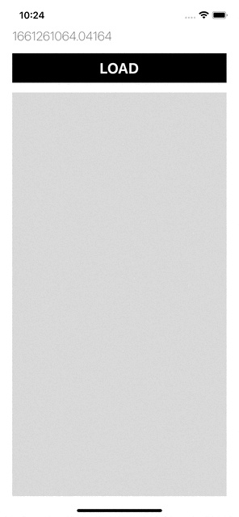
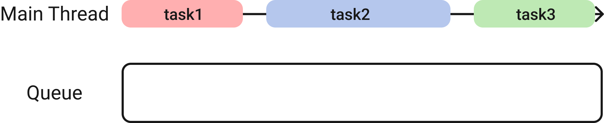
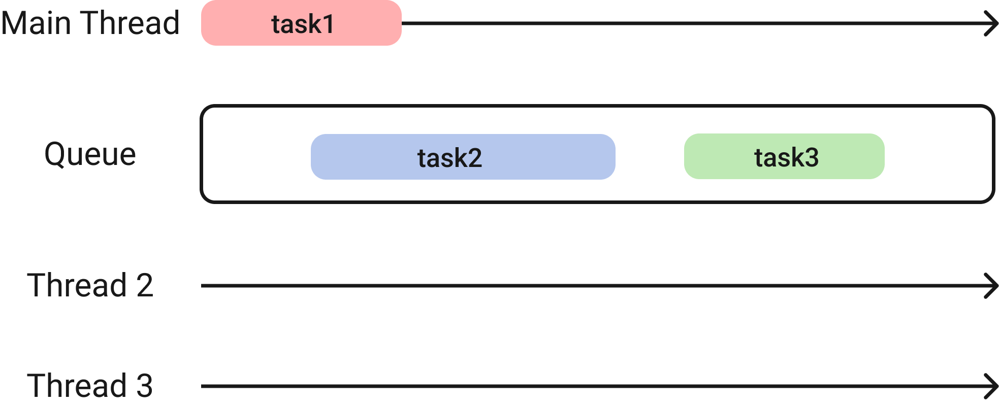
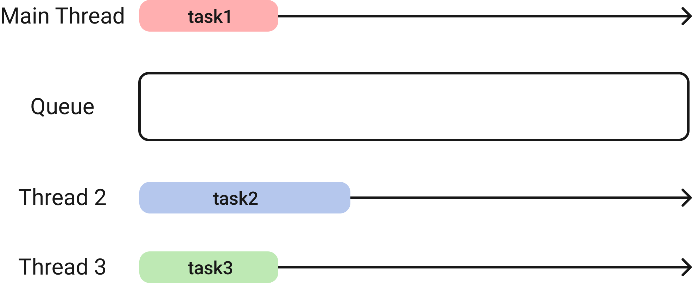
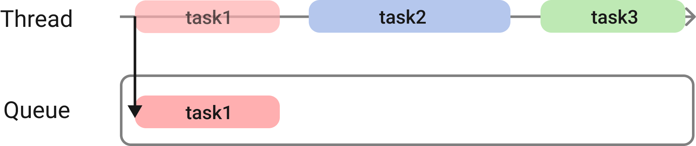
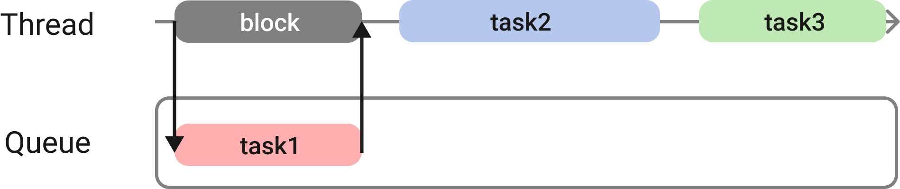
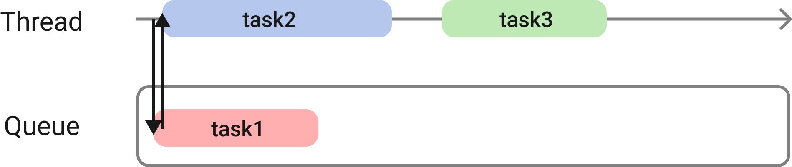
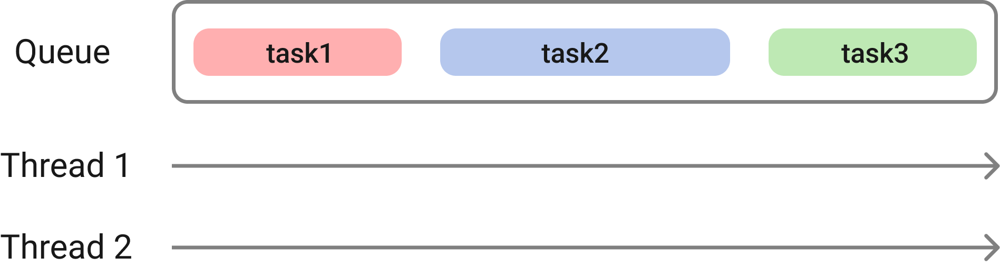
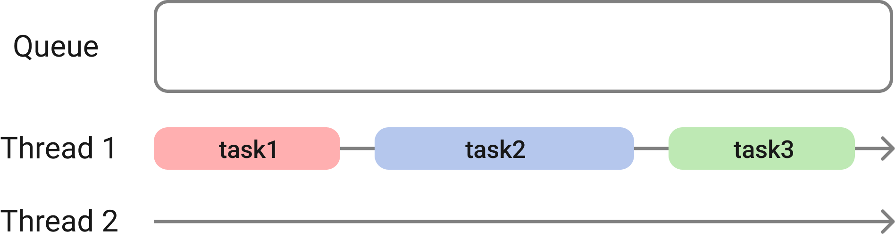
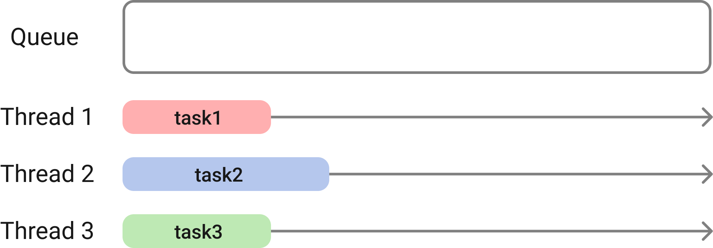

> 이미지 출처 : 곰튀김님 유튜브 - 시즌2 모임 종합편입니다 

서버로부터 데이터를 받기 위해 load 버튼을 누르니 UI가 멈추는 일이 발생한다. 60Hz를 지원하는 아이폰에서는 16밀리 초마다 화면을 리프레싱 한다. 위 사진에서는 사용자가 load 버튼을 누르면서 os는 서버 통신을 수행하게 되고 서버 통신으로 인해 화면 리프레싱 작업이 후순위로 미루어져  화면이 멈추는 일이 발생한 것이다. 즉 메인 스레드에서 모든 작업을 처리해 생긴 일이다.

# **동시성(Concurrency) 프로그래밍**

동시성(Concurrency)은 일반적으로 동시에 발생하거나 존재하는 사건이나 상황을 의미한다. 프로그래밍 관점에서 동시성 프로그래밍이란 싱글 프로세서에서 멀티 스레드를 동작시키기 위한 방식으로 멀티 태스킹을 위해 여러 개의 스레드가 컨텍스트 스위칭(context switching)하며 실행되는 방식을 말한다. 다중 프로세서에서 동시에 여러 작업을 실행하는 병렬 프로그래밍(parallel programming)과는 다른 개념이다.

IOS는 메인 스레드에 몰린 작업들을 대기 행렬(큐)에 넣어주기만 하면 os 차원에서 스레드를 관리하여 선입 선출한 작업을 스레드에 배정해준다. 따라서 개발자는 직접적으로 스레드를 관리하지 않아도 된다.

예를 들어 메인 스레드에 task1, task2, task3가 있을 때 task2와 task3을 큐에 넣어주면 os는 스레드를 만들어 작업을 배정한다.

|  |  |
| --- | --- |

# **Sync와 Async**

동기(sync)와 비동기(async)의 구분은 작업을 큐에 보내는 시점에서 작업을 보낸 스레드에서 보낸 작업이 완료되는 것을 기다는 지로 구분할 수 있다.

## **동기(sync)**

동기는 작업을 큐에 보내는 시점에서 보낸 스레드가 해당 작업이 끝날 때까지 기다린다. 사실 큐에 보내지 않고 해당 스레드에서 작업하는 것과 동일하다고 한다.

## **비동기(async)**

비동기는 작업을 큐에 보내는 시점에서 보낸 스레드가 해당 작업이 끝날 때까지 기다리지 않는다. 그러므로 보낸 스레드에서는 다음 작업을 바로 실행한다.

# **Serial과 Concurrent**

직렬(serial)과 동시(concurrent)는 큐의 특성에 관련된 것이다. 큐에 다음과 같은 작업이 배정되었을 때 스레드에 작업을 배정시키는 방식에 따라 구분할 수 있다.

## **직렬(serial)**

직렬(serial) 큐는 분산 처리한 작업을 다른 한 개의 스레드에서 처리하는 큐이다. 큐에 보내진 작업들의 실행 순서가 중요할 때 사용한다.

## **동시(concurrent)**

동시(concurrent) 큐는 분산 처리한 작업들을 여러 개의 스레드에서 처리하는 큐이다. 몇 개의 스레드로 분산 처리할지는 os가 결정한다. 작업들이 서로 독립적이지만 유사할 때 사용한다.

