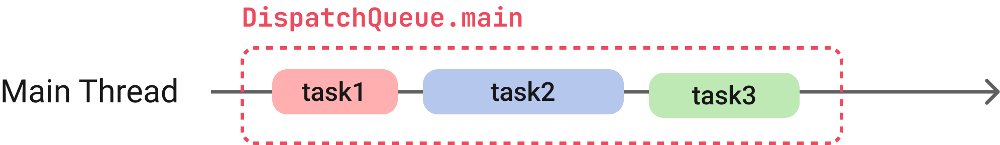
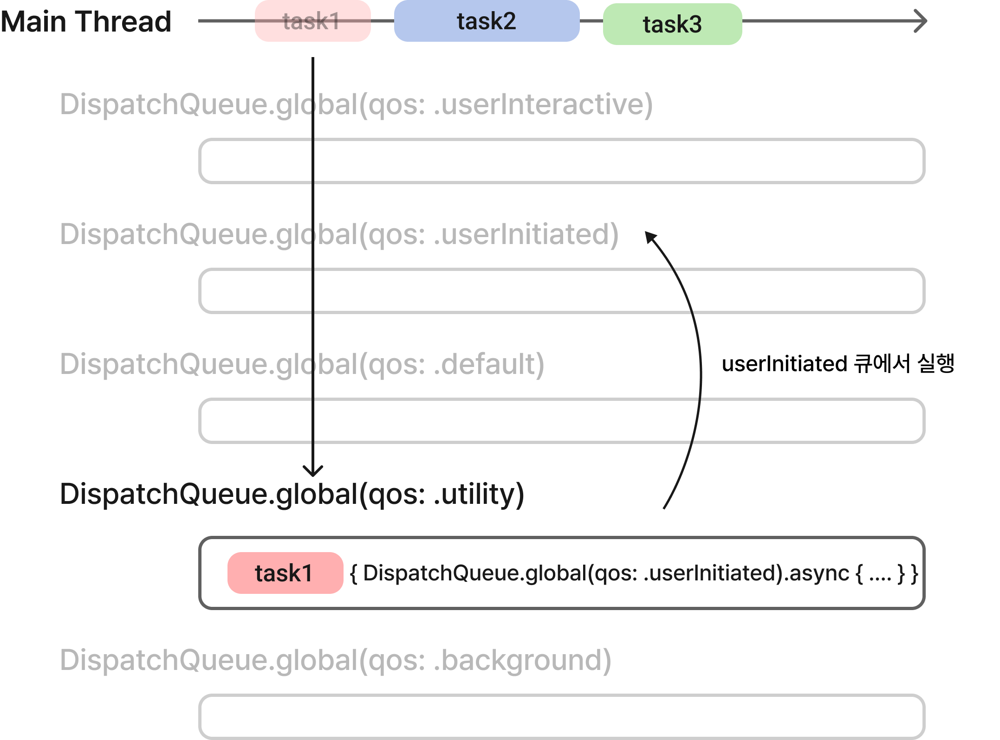

# **GCD(Grand Central Dispatch)**

GCD(Grand Central Dispatch)란 멀티 코어와 멀티 프로세싱 환경에서 최적화된 프로그래밍을 할 수 있도록 애플이 개발한 기술이다. Dispatch Queue에 들어온 작업을 직렬적(serially) 또는 동시적(concurrently)으로 실행한다. 큐에 들어온 작업은 시스템에 의해 생성된 스레드에서 동기적(synchronously) 또는 비동기적(asynchronously)으로 실행되며 작업이 종료되면 해당 스레드를 제거한다.

DispatchQueue는 3가지 종류가 있다.

- main
- global
- custom

## **main**



메인 디스패치 큐는 기본적으로 직렬 큐이고 메인 스레드에 작업을 배정한다. [만약 메인 스레드가 너무 오랫동안 응답하지 않으면 0x8badf00d exception이 발생할 수 있다고 한다.](https://developer.apple.com/documentation/dispatch/dispatchqueue/1781006-main) 그러므로 네트워크 통신과 같이 오래 걸리는 작업은 global queue를 사용해 다른 스레드에서 작업하는 것을 권장한다.

## **global**

글로벌 디스패치 큐는 기본적으로 동시 큐이고 메인 스레드가 아닌 다른 스레드에 작업을 배정한다. `DispatchQos`에 따라 6가지로 나눌 수 있다. qos(quality-of-service)를 사용하여 큐로 보낸 작업의 의도를 시스템에 전달한다. 시스템은 qos에 따라 작업의 중요성을 판단하고 적절한 자원을 분배한다. 예를 들어 유저와 상호작용하는 작업의 경우 높은 우선순위를 주어 여러 개의 스레드를 배정하고 많은 전력을 사용해 빠르게 실행되도록 한다.

### **종류**

- **userInteractive**\
    애니메이션, 이벤트 처리 또는 앱의 인터페이스 업데이트와 같은 유저와 직접적으로 상호작용하는 작업에 할당할 수 있다.
- **userInitiated**\
    유저가 하는 작업에 즉각적인 결과를 제공하거나 유저가 앱을 사용하지 못하게 하는 작업에 할당할 수 있다. 비동기적으로 처리된 작업을 예로 들 수 있다.
- **default**\
    디폴트로 설정된 값으로 일반적인 작업을 할 때 사용하면 된다. 그냥 모르면 이거 쓰자.
- **utility**\
    보통 progress indicator와 함께 길게 실행되는 작업, 계산, IO, Networking, 지속적인 데이터 feed 작업에 할당할 수 있다.
- **background**\
    유저가 직접적으로 인지하지 않는 작업과 같이 앱의 백그라운드에서 실행되는 작업을 수행하는 데 사용하는 작업에 할당할 수 있다. 속도보다는 효율성을 중시할 때 사용한다.

### **특징**



글로벌 디스패치 큐로 보내진 작업이 설정한 qos보다 높은 우선순위에서 작업이 실행되어야 한다면 시스템은 현재 설정한 큐의 품질을 향상한다. 예를 들어 `utility` 큐로 작업을 보냈지만 작업 내부에선 `userInitiated` 큐에서 실행되는 코드가 있을 때 시스템은 작업을 `userInitiated` 큐로 보낸다.

## **custom**

커스텀 디스패치 큐는 기본 설정이 직렬 큐로 글로벌 큐처럼 qos를 설정할 수 있다. `label`를 지정해 만들 수 있다. `attributes` 파라미터를 통해 동시 큐로 바꿀 수 있다.

```swift
let customSerialQueue = DispatchQueue(label: "serialQueue")
let customConcurrentQueue = DispatchQueue(label: "concurrentQueue", attributes: .concurrent)
```

## **주의 사항**

**⦁ 반드시 UI 관련 작업은 메인 큐(=스레드)로 처리해야 한다.**

[iOS: Why the UI need to be updated on Main Thread](https://medium.com/@duwei199714/ios-why-the-ui-need-to-be-updated-on-main-thread-fd0fef070e7f)

**⦁ 메인 스레드에서 다른 큐로 동기적으로 보내면 안 된다.**

1번과 비슷한 맥락으로 메인 스레드가 보낸 작업을 기다리게 되면 화면이 버벅 거리게 된다. 따라서 메인 스레드에서는 항상 비동기적으로 작업을 다른 큐에 보내야 한다.

**⦁ 현재 큐에서 현재 큐로 동기적으로 보내면 안 된다.**  

현재 큐에서 현재 큐로 동기적으로 작업을 보내는 경우를 생각해보자. 현재 큐가 배정한 스레드에서 작업을 수행 중이다가 현재 큐로 다시 어떤 작업을 동기적으로 보내는 경우이다.

```swift
DispatchQueue.global().async {
    task()
    DispatchQueue.global().sync {
        task1()
    }
}
```


현재 스레드는 동기적으로 task1을 보내 다른 스레드에서 task1이 끝나길 기다리면서 현재 스레드를 블럭 처리한다. 하지만 운이 나쁘게도 시스템은 같은 스레드로 task1을 배정하는 경우가 생길 수 있다. 교착 상태(dead lock)가 발생할 수 있다.


따라서 아래 코드의 실행 결과는 1을 출력하고 교착 상태에 빠진다.

```swift
// 출처 : 유튜브 IOS Academy 커뮤니티 게시글
let queue = DispatchQueue(label: "io.iosacademy.queue")

queue.async {
    print("1")
    queue.sync {
        print("2")
        queue.async {
            print("3")
        }
    }
}

queue.async {
    print("4")
}

queue.async {
    print("5")
}
```

**⦁ 순환 참조를 주의해야 한다.**

디스 패치 큐로 작업을 보낼 때 클로저로 보내기 때문에 항상 순한 참조를 조심해야 한다. `weak`나 `unowned`를 사용해 해결할 수 있다.