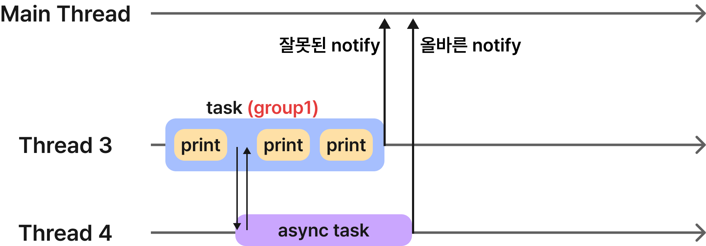

디스패치 큐(Dispatch Queue)를 사용해 메인 스레드뿐만 아니라 다른 스레드에서 작업을 수행했다. 디스패치 큐를 사용함으로써 디스패치 큐에 보낸 작업이 어떤 스레드에서 동기/비동기로 실행되는 시점을 알 수 있지만 작업이 끝난 시점을 알 수는 없었다. 작업이 끝난 시점을 알기 위해서는 디스패치 그룹(Dispatch Group)을 사용해야 한다.

# **Dispatch Group**

디스패치 그룹 사용하면 하나의 작업 집합을 만들 수 있다. 하나의 집합으로 묶인 작업들은 같은 큐 혹은 서로 다른 큐에서 비동기적으로 수행된다. 여기까지는 디스패치 큐로 직접 각각 작업을 보내는 것과 차이점이 없지만 디스패치 그룹은 모든 작업이 완료되면 completion handler를 실행한다. 따라서 우리는 completion handler를 통해 그룹의 속한 모든 작업이 끝난 시점을 알 수 있다!

## **Dispatch Group과 동기적 작업**

```swift
let group1 = DispatchGroup()
DispatchQueue.global(qos: .userInteractive).async(group: group1) { task1() }
DispatchQueue.global(qos: .userInteractive).async(group: group1) { task2() }
DispatchQueue.global(qos: .userInteractive).async(group: group1) { task3() }

DispatchQueue.global(qos: .default).async(group: group1) { task4() }
DispatchQueue.global(qos: .default).async(group: group1) { task5() }
```


예를 들어 같은 그룹(group1)으로 묶은 작업(task)을 서로 다른 큐에서 비동기적으로 실행했을 때 디스패치 그룹의 `notify` 메서드에 클로저를 전달해 모든 작업이 완료되었을 때 실행할 작업을 정할 수 있다.

```swift
group1.notify(queue: .main) { 
    // 완료 되었을 때 실행할 작업
}
```


## **Dispatch Group과 비동기적 작업**

잘 생각해보면 디스패치 그룹이 작업의 완료 시점을 알려주는 것은 수행되는 작업이 동기적으로 수행되었기 때문에 가능했다. 디스패치 그룹이 notify 하는 시점은 스레드로 배정된 작업이 끝난 시점이라는 것이다. 만약 작업 내부에서 비동기적으로 수행되는 작업이 있는 경우에는 스레드는 다른 스레드로 보낸 비동기적 작업을 기다리지 않으므로 보낸 비동기 작업이 끝나기도 전에 잘못 notify를 한다.



\
이를 해결하기 위해 IOS는 현재 스레드 내에서 비동기적 작업을 다른 스레드로 보낼 때 카운트를 증가시킨 후 비동기 작업이 끝날 때 카운트를 감소시켜 비동기 작업이 끝났다는 것을 확인한다. 비동기적 작업을 보낼 때 디스패치 그룹의 enter() 메서드를 호출하여 카운트를 증가시키고, 비동기적 작업이 끝났으면 completion 혹은 defer 메서드에서 leave() 메서드를 호출하여 카운트를 감소시킨다. 만약 그룹의 동기적 작업이 모두 완료되었을 뿐만 아니라 카운트도 0이라면 이때 `notify`를 한다.


### **실습**

버튼을 클릭하여 이미지를 다운로드하고 모든 이미지가 다운로드하여지면 텍스트를 바꿔보자.


 \
URLSession은 내부적으로 비동기 작업이므로 URLSession 코드 전에 `enter` 메서드를 실행하여 카운트를 늘려주고 `defer` 메서드를 사용해 메서드가 끝날 때 `leave` 메서드를 실행시킨다. 이미지 뷰와 텍스트 업데이트는 메인 스레드에서 해야 한다.

```swift
@objc func tapButton() {
    let group = DispatchGroup()
    
    group.enter()
    URLSession.shared.dataTask(with: URL(string: urlArray[0])!) { [weak self] data, _, error in
        defer { group.leave() }
        guard let self = self, error == nil, let data = data else { return }
        DispatchQueue.main.async {
            self.firstView.image = UIImage(data: data)
        }
    }.resume()
    
    group.enter()
    URLSession.shared.dataTask(with: URL(string: urlArray[1])!) { [weak self] data, _, error in
        defer { group.leave() }
        guard let self = self, error == nil, let data = data else { return }
        DispatchQueue.main.async {
            self.secondView.image = UIImage(data: data)
        }
    }.resume()
    
    group.enter()
    URLSession.shared.dataTask(with: URL(string: urlArray[2])!) { [weak self] data, _, error in
        defer { group.leave() }
        guard let self = self, error == nil, let data = data else { return }
        DispatchQueue.main.async {
            self.thirdView.image = UIImage(data: data)
        }
    }.resume()
    
    group.notify(queue: .main) { [weak self] in
        guard let self = self else { return }
        self.label.text = "다운로드 완료"
    }
}
```

## **Dispatch Group의 동기적 기다림**

지금까지 현재 스레드에서 그룹을 만들어 작업을 비동기적으로 다른 스레드로 실행했다. 물론 현재 스레드에서 동기적으로 보낼 수도 있다. `wait` 메서드를 사용하면 다른 스레드로 보낸 그룹 내 모든 작업이 종료될 때까지 보낸 스레드를 블록 처리하고 기다린다. 동기적으로 어떤 작업을 보낼 때 주의할 점은 메인 스레드에서는 항상 동기적으로 작업을 보내면 안 되는 것이다.

`wait` 메서드는 파라미터로 `DispatchTime` 구조체 타입을 받는데 파라미터로 전달한 시간만큼 기다린다. 보낸 스레드가 전달한 시간만큼 기다리는 것이지 전달한 시간이 지났다고 보낸 작업이 중단되는 것은 아니다.