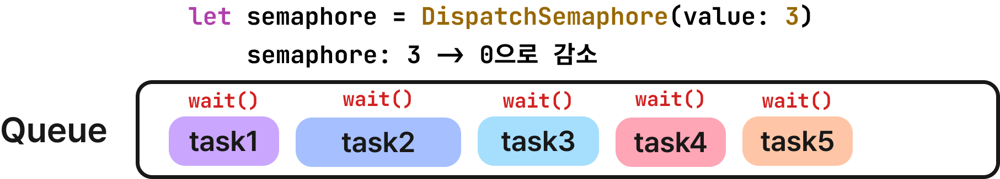
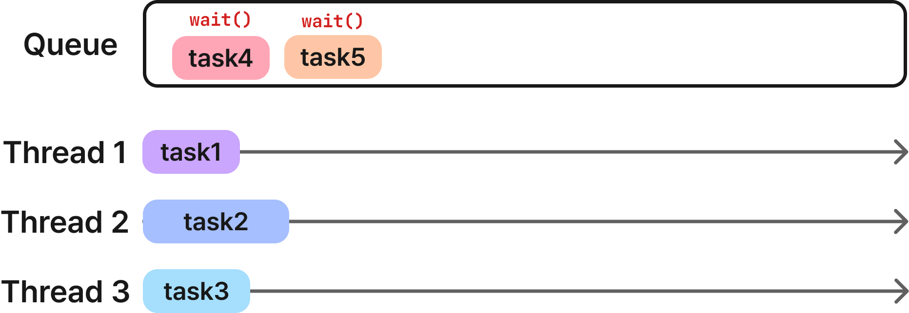
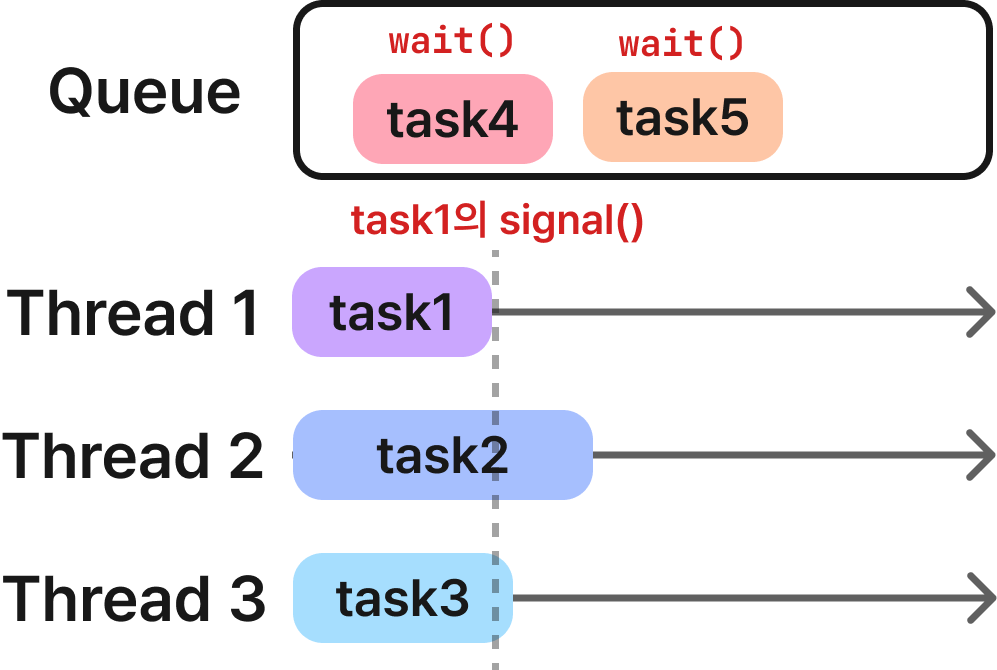
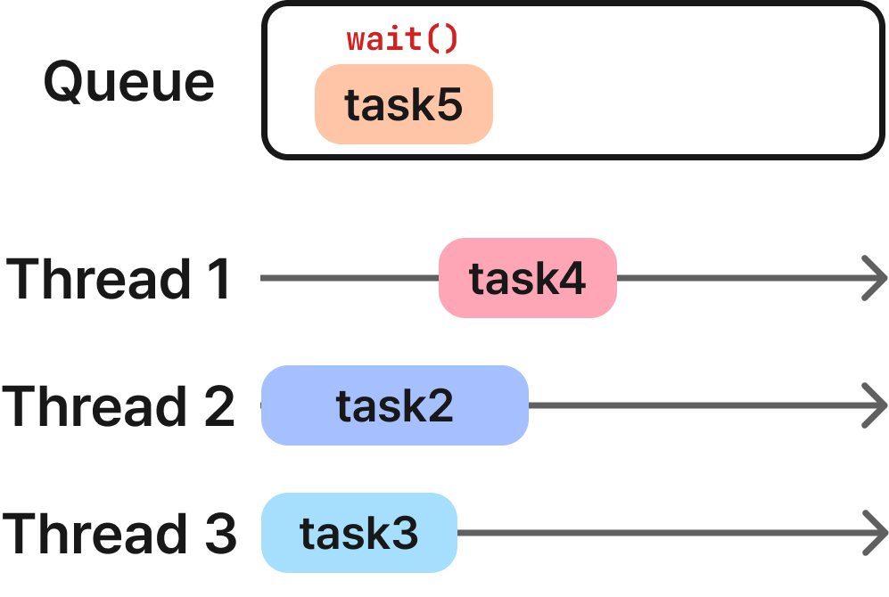

# **디스패치 세마포어(Dispatach Semaphore)**

## **세마포어(Semaphore)**

비동기 처리로 인해 공유 자원에 동시에 접근하여 데이터 불일치가 발생하는 경쟁 상태(Race Condition)를 막기 위해 스레드(혹은 프로세스) 간의 동기화가 필요하다. 임계 구역(Critical Section)에 한 개의 스레드가 접근했다면 다른 스레드에서는 접근하지 못하도록 해야 한다. 세마포어(Semaphore)는 임계 구역 문제(Critical Section Problem)를 해결하기 위한 여러 가지 방법 중 한 개다.

세마포어는 양수 값 $(S)$으로 $S$를 수정하는 두 가지 연산을 수행한다.

- `wait` : 만약 값이 0이 아니면 하나 감소시키고 critical section에 진입한다. 그렇지 않으면 signal 연산이 실행되어 값이 증가하기 전까지 해당 작업을 차단한다.
- `signal` : 대기 중인 스레드가 있는 경우, 스레드의 차단을 해제하고, 그렇지 않으면 값을 증가시킨다.

## **디스패치 세마포어(Dispatach Semaphore)**

> An object that controls access to a resource across multiple execution contexts through use of a traditional counting semaphore.

IOS의 디스패치 세마포어(Dispatch Semaphore)는 계수 세마포어(Counting Semaphore)로 초기 값으로 접근 가능한 스레드의 개수를 갖는다. 디스패치 세마포어는 최대 N개의 스레드에서 동시에  접근할 수 있는 자원이 있을 때 사용할 수 있다. 세마포어의 초기 값을 N으로 설정하면 처음 N개의 스레드는 차단되지 않고 동시에 자원에 접근할 수 있지만 N+1번째 스레드부터는 이전 N개의 스레드에서 signal 메서드가 실행되어 세마포어의 값이 양수가 될 때까지 차단된다. N = 1로 설정하면 뮤텍스 락(mutex lock)을 기능을 할 수 있다.

```swift
init(value: Int) // Creates new counting semaphore with an initial value.
let semaphore = DispatchSemaphore(value: 3)
```

[]

세마포어의 값을 3으로 설정하고 5개의 작업을 큐로 보낼 때 5개 작업이 모두 스레드에 배정되는 것이 아닌 3개의 작업만 스레드에 배정된다. 4번째 작업의 wait()를 실행하고 작업을 큐에 넣었을 때 이미 세마포어의 값은 0이기 때문에 4번째 작업은 차단된다.



task1이 끝나고 signal()를 실행해 세마포어의 값을 1로 올리면 task4의 차단이 해제되고 task4의 작업이 시작된다.

|  |  |
| --- | --- |

## **디스패치 그룹과 사용**

디스패치 세마포어는 디스패치 그룹과 같이 사용할 수 있다. 작업을 하나의 그룹으로 묶고 세마포어를 통해 최대 실행될 작업의 개수를 제한해 마지막 작업이 끝났을 때 `notify`하게 할 수도 있다.
