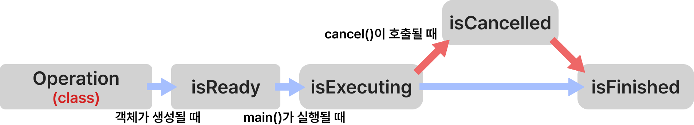
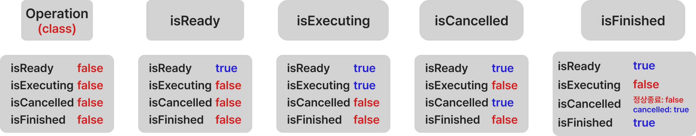
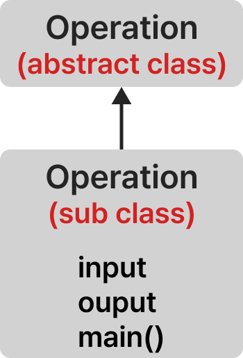
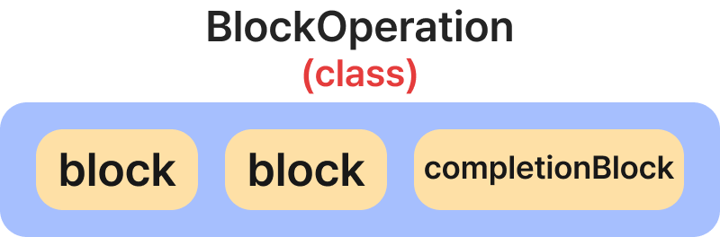
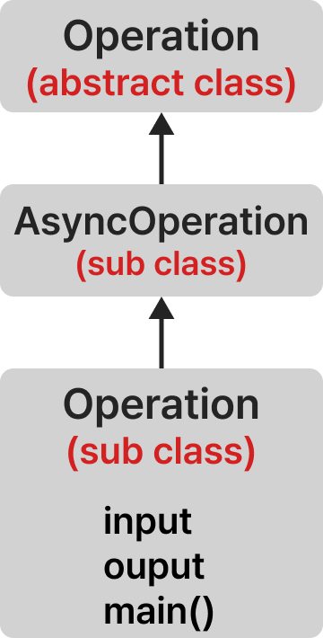

# **Operation, AsyncOperation**

## **Operation**

IOS에서 오퍼레이션(Operation)이란 추상 클래스로 어떤 단위적인 작업을 클래스 화하여 사용할 수 있다. 오퍼레이션은 싱글-샷 객체(Single-Shot Object)인데 인스턴스화 하여 딱 한 번만 실행 가능하기 때문이다. 따라서 작업을 재사용하기 위해서는 객체를 다시 생성해야 한다.

일반적으로 오퍼레이션 큐(Operation Queue)에 넣어 비동기적 다른 스레드에서 작업을 수행하지만 오퍼레이션 자체의 `start()` 메서드를 사용해 현재 스레드에서 동기적으로 사용할 수도 있다.

오퍼레이션을 오퍼레이션 큐와 같이 사용할 경우 오퍼레이션의 의존성(Dependencies)을 사용해 순서를 정할 수 있다. B 작업이 A 작업이 종료된 후에 실행되어야 한다면 B작업은 A 작업에 의존적이라고 할 수 있다. 이때 둘 사이의 프로토콜을 정의하여 A의 결과물을 B의 입력으로 사용할 수 있다. (자세한 내용은 Operation Queue 게시글에서 작성할 예정)

## **State Properties**

오퍼레이션은 작업의 진행 상태를 나타내는 읽기 전용 프로퍼티를 갖고있고 이 프로퍼티는 KVC(Key-Value Coding)과 KVO(Key-Value Observing)을 준수한다.

- `isCancelled`
- `isExecuting`
- `isFinished`
- `isReady`



오퍼레이션은 객체 생성시 준비(isReady) 상태가 되며 start()를 호출하거나 오퍼레이션 큐(Operation Queue)에 작업을 추가하여 실행하면 isExecuting 상태가 되며 정상적으로 종료되면 isFinished 상태가 된다. 만약 작업 중간에 cancel()이 실행되면 isCancelled 프로퍼티가 true가 된다. 이때 작업은 멈추지 않고 계속 실행된다. 작업을 멈추려면 main이나 completionBlock에서 isCancelled 상태에 따라 작업을 멈추는 코드를 구현해야 한다.



## **구현**



오퍼레이션을 구현하기위해서는 오퍼레이션 추상 클래스 상속하여 오퍼레이션 클래스를 구현해야 한다.


오퍼레이션 클래스는 input, output 프로퍼티를 가지며 main 함수를 오버로딩하여 구현해야 한다. 예를 들어 1을 더하는 작업을 하는 오퍼레이션 클래스를 구현하면 아래와 같다.

```swift
class PlusOne: Operation {
    var inputNumber: Int
    var outputNumber: Int?
    
    init(input: Int) {
        inputNumber = input
        super.init()
    }
    
    override func main() {
        outputNumber = inputNumber + 1
    }
}
```

만약 간단한 작업일 경우에는 블록 오퍼레이션(BlockOperation)을 구현할 수 있다. 블록이란 클로저로 이해하면 편하다. 블럭 오퍼레이션 내부의 블럭들은 기본적으로 디스패치 큐의 글로벌 큐에서 동시적으로 실행된다. 또한 모든 작업이 종료되면 컴플리션 블럭이 실행된다.



구현은 간단하다. BlockOperation 클래스를 만들고 작업을 추가하면 된다.

```swift
let multiPrinter = BlockOperation()

multiPrinter.completionBlock = {
    print("===모든 출력의 완료!===")
}

multiPrinter.addExecutionBlock {  print("Hello,"); sleep(2) }
multiPrinter.addExecutionBlock {  print("This"); sleep(2) }
multiPrinter.addExecutionBlock {  print("is"); sleep(2) }
multiPrinter.addExecutionBlock {  print("Operation"); sleep(2) }
multiPrinter.addExecutionBlock {  print("Class"); sleep(2) }
```

## **AsyncOperation**



Operation의 경우 main에 작성된 작업이 동기적으로 실행되어야 한다. GCD 같은 경우에는 enter()과 leave()를 통해 비동기 작업을 처리했다. Operation의 경우 main 메서드 안에 비동기 코드가 있다면 AsyncOperation을 구현해야 한다. AsyncOperation의 경우 IOS에서 제공해주고 있지 않지만 똑똑한 분들이 만들어 놓으셔서 구글링 하면 쉽게 얻을 수 있다.

주의해야 할 것은 작업의 상태를 수동으로 관리해주어야 하는 점이다. main에 작성된 비동기 코드가 종료되면 completion handler에서 작업의 상태를 종료로 바꿔야 한다.
