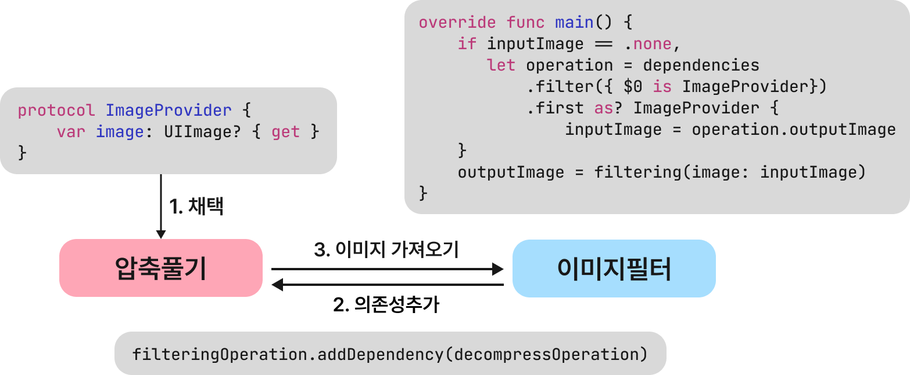

# **Operation Queue - Managing the Execution of Operations**

> 본 게시글은 인프런에서 앨런님의 iOS Concurrency(동시성) 프로그래밍, 동기 비동기 처리 그리고 GCD/Operation - 디스패치 큐와 오퍼레이션 큐의 이해를 듣고 공부한 글입니다.

오퍼레이션 큐는 디스패치 큐(Dispatch Queue)에서 몇 가지 기능(일시 중지, 다시 시작, 취소 등)을 추가한 것으로 내부적으로는 GCD 위에서 돌아간다. 오퍼레이션(Operation)을 start 메서드로 현재 스레드에서 실행할 수 있지만 대부분의 경우 오퍼레이션 큐(Operation Queue)에 넣어 사용한다.  오퍼레이션 큐에 추가된 오퍼레이션은 우선순위와 준비 상태, 의존성(작업 순서)에 따라 실행된다.

### **maxConcurrentOperationCount**

오퍼레이션 큐는 기본적으로 동시 큐이며 `maxConcurrentOperationCount` 프로퍼티를 통해 동시에 실행할 작업의 개수를 정할 수 있다. `maxConcurrentOperationCount`가 1일 경우 직렬 큐 역할을 한다.

### **qualityOfService**

오퍼레이션 큐의 서비스 품질(Qos)은 큐에 추가된 오퍼레이션의 서비스 수준을 가리킨다. 종류는 아래와 같다.

- `userInteractive`
- `userInitiated`
- `default`
- `utility`
- `background`

오퍼레이션 큐의 기본 서비스 품질은 `background`이다. 만약 오퍼레이션 자체의 서비스 품질이 정해진 경우 오퍼레이션 큐의 서비스 품질이 상승할 수도 있다. 오퍼레이션 큐는 기반이 되는 디스패치 큐를 지정하는 기능을 제공한다. 따라서 기반이 되는 디스패치 큐의 서비스 품질을 지정하면 오퍼레이션 큐의 서비스 품질이 우선적으로 적용된다. 참고로 오퍼레이션 큐가 메인 스레드로 작업을 배정한 경우 서비스 품질은 무조건 `userInteractive`이고 수정할 수 없다.

### **Operation Dependencies**


오퍼레이션의 `addDependency(_:)와 removeDependency(_:) 메서드를` 사용하여 의존성을 설정해 오퍼레이션의 순서를 정할 수 있다. 다운로드, 압축 풀기, 이미지 필터 순으로 작업이 진행되는 경우 압축 풀기 작업은 다운로드 작업의 결과물인 압축파일이 있어야 작업이 시작되므로 다운로드 작업에 의존한다고 할 수 있다.

```swift
let imageLoadOperation = ImageLoadOperation()
let decompressOperation = DecompressOperation()
let filterOperation = FilterOperation()

decompressOperation.addDependency(imageLoadOperation)
filterOperation.addDependency(decompressOperation)
```



오퍼레이션은 `input`와 `output` 프로퍼티를 가지고 있다. 이전 작업에서 생성된 결과물이 현재 작업의 준비물로 전달되어야 한다. 이 문제는 프로토콜의 연산 프로퍼티와 오퍼레이션의 `dependencies: [Operation]` 프로퍼티로 해결할 수 있다. `dependencies` 프로퍼티는 현재 작업이 의존하는 작업의 배열이다.. 오퍼레이션의 `dependencies` 통해 의존하는 오퍼레이션에 접근하여 프로토콜의 연산 프로퍼티를 사용해 `output`값을 가져올 수 있다.

```swift
protocol ImageProvider {
    var image: UIImage? { get } 
}

extension DecompressOperation: ImageProvider {
    var image: UIImage? { return outputImage } 
}

// FilterOperation Class
class FilterOperation: Operation { 
    var inputImage: UIImage?
    var outputImage: UIImage?
    
    override func main() {
        if inputImage == .none,    
            let operation = dependencies
                .filter({ $0 is ImageProvider})
                .first as? ImageProvider {  
                    inputImage = operation.outputImage
        }

        // 실제 작업
        outputImage = filtering(image: inputImage)
    }
}
```

다수의 오퍼레이션 큐를 사용하여 순서를 지정할 때 주의해할 점이 있다. 아래와 같이 오퍼레이션의 사이클이 존재하면 교착상황이 발생하여 사이클 내부의 일부 작업이 실행되지 않고 무한정 대기할 수 있다.

